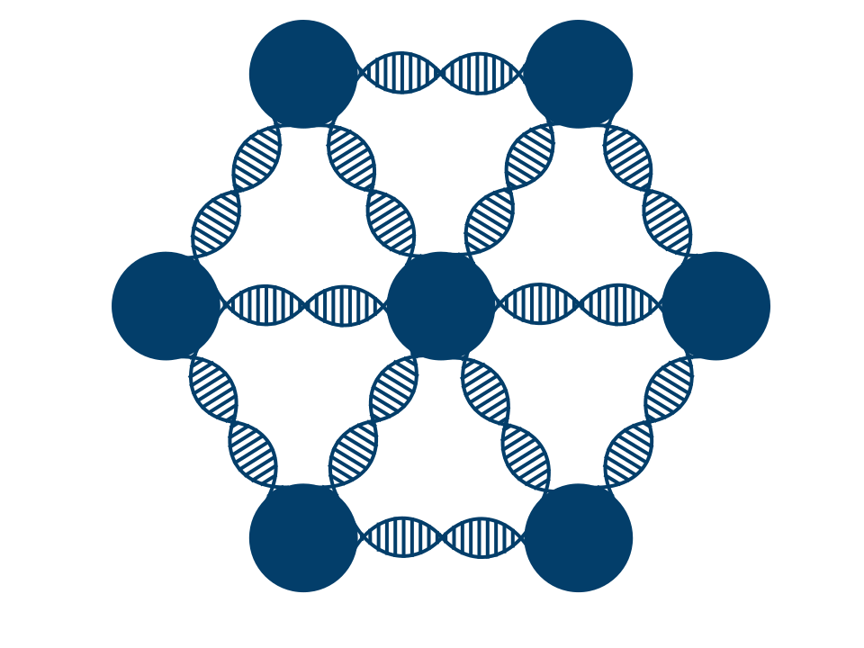

..  PSL-GWAS documentation master file, created by
    sphinx-quickstart on Mon May 11 11:03:18 2020.
    You can adapt this file completely to your liking, but it should at least
    contain the root `toctree` directive.

PSL-GWAS Documentation
======================

PSL-GWAS performs genome-wide association studies (`GWAS`_) on microbes
using Probabilistic Soft Logic (`PSL`_), a statistical
relational programming framework.

A microbial genome-wide association study is a method for finding
genetic elements associated with one or more phenotypes of interest.
Genetic elements include chromosomal and plasmid genes, SNPs, indels,
and copy number variants. Phenotypes of interest could include antibiotic
resistance or virulence.

Given some microbial samples, including their sequenced genomes and
information on which samples display which phenotypes,
PSL-GWAS finds genetic elements likely to cause those phenotypes.

Unlike other microbial GWAS programs, PSL-GWAS implicitly models
bacterial population structure and other domain-specific attributes,
and can efficiently infer over multiple phenotypes simultaneously.
PSL-GWAS is also easy to customize, allowing users to incorporate
domain-specific knowledge in their models.

PSL-GWAS is open source and licensed under the MIT license.
The source code is available on `Github`_.

.. toctree::
    :maxdepth: 2
    :caption: Contents:

    self
    overview.rst
    installation.rst
    usage.rst
    example.rst
    customization.rst

.. _PSL: https://psl.linqs.org/wiki/master/Introduction-to-Probabilistic-Soft-Logic.html
.. _GWAS: https://en.wikipedia.org/wiki/Genome-wide_association_study
.. _Github: https://github.com/elip12/psl-gwas
